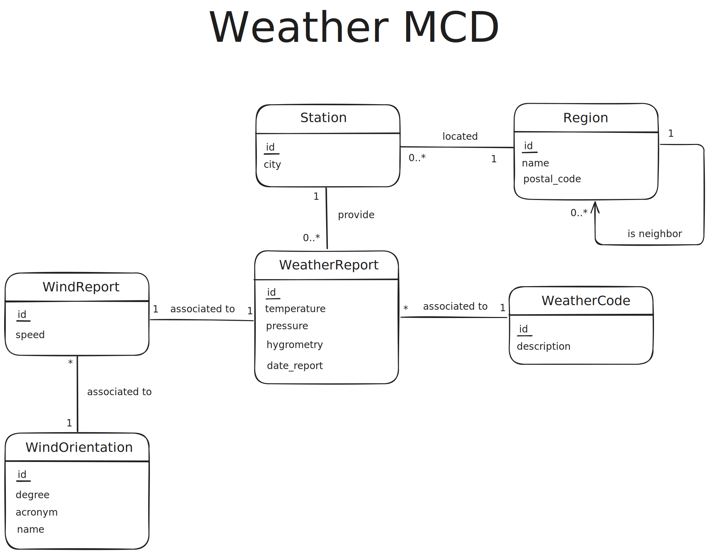

# Rapport de Conception – Base de Données Météo

> Christopher GERARD & Danaé ALBRECHT--MARTIN

## 1. Introduction

Ce projet vise à concevoir une base de données relationnelle pour stocker et exploiter des relevés météorologiques. La solution s’appuie sur MySQL, déployé via Docker, et propose un schéma structuré pour gérer les stations, les régions, les relevés météo, les vents, etc.

---

## 2. Modèle Conceptuel de Données (MCD)

Le MCD représente les entités principales et leurs relations :

- **Région** : Peut être hiérarchique (une région peut dépendre d’une autre région).
- **Station** : Appartient à une région.
- **Orientation du vent** : Définit l’orientation (degré, acronyme, nom).
- **Relevé de vent** : Associe une vitesse à une orientation.
- **Code météo** : Décrit un état météorologique (ex : pluie, soleil).
- **Relevé météo** : Associe température, pression, hygrométrie, date, station, vent et code météo.

### Diagramme MCD

---

## 3. Modèle Logique de Données (MLD)

### Diagramme MLD

---

## 4. Justifications des Choix de Modélisation

### a. Hiérarchie des Régions

La table `Region` possède une clé étrangère `id_regionFK` pointant sur elle-même, permettant de modéliser des régions imbriquées (ex : région, département).

### b. Stations et Régions

Chaque station météo est liée à une région via `id_regionFK`, ce qui permet de regrouper les stations par zone géographique.

### c. Gestion du Vent

La séparation entre `WindOrientation` et `WindReport` permet de factoriser les orientations (N, S, E, O, etc.) et d’associer à chaque relevé de vent une orientation précise et une vitesse.

### d. Codes Météo

La table `WeatherCode` permet de centraliser les types de phénomènes météorologiques (ex : pluie, neige, brouillard), facilitant l’évolution du référentiel.

### e. Relevés Météo

La table `WeatherReport` centralise les mesures (température, pression, hygrométrie) et référence la station, le vent et le code météo associés, assurant la cohérence et la normalisation des données.

---

## 5. Analyse du Script d’Initialisation

Le script [`sql/initWeatherDatabase.sql`](sql/initWeatherDatabase.sql) :

- Définit l’encodage en UTF-8 pour supporter les caractères spéciaux.
- Crée la base `weather` si elle n’existe pas.
- Supprime les tables dans l’ordre inverse des dépendances pour éviter les erreurs de contrainte.
- Crée chaque table avec ses clés primaires et étrangères, respectant le MLD.
- Les types de données sont adaptés (ex : `DECIMAL` pour les mesures, `DATETIME` pour les dates).
- Les contraintes d’intégrité référentielle sont systématiquement posées pour garantir la cohérence des données.